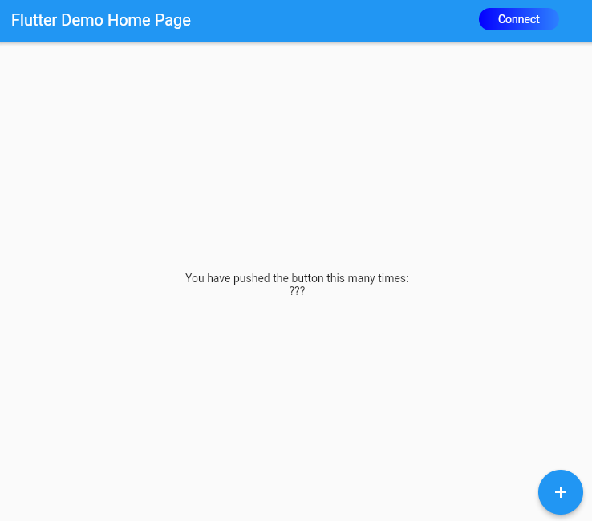
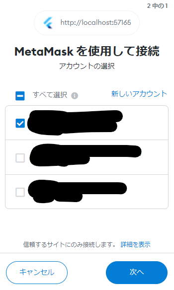
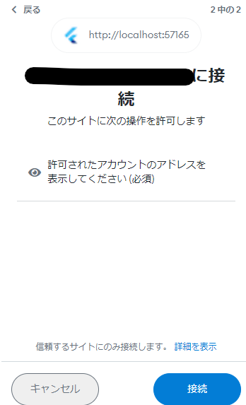
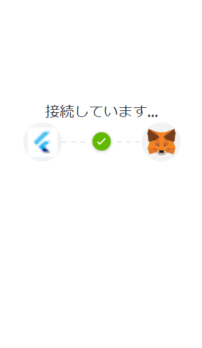
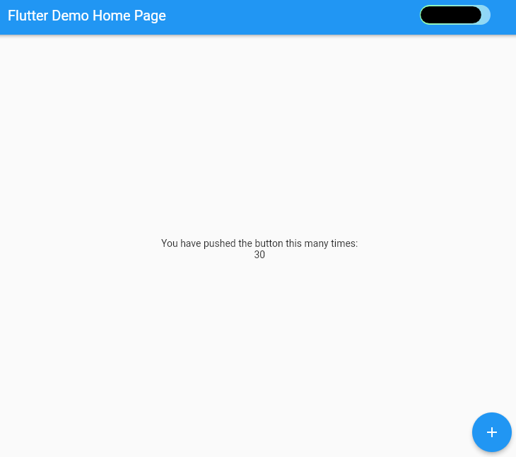
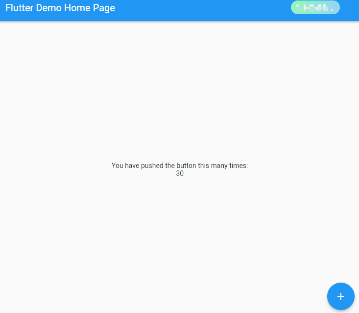

# dapp_astar_evm_example

A Flutter increment value project with smart contract on Astar local.

## Getting Started

### Prepaire

You should run astar-collator in your local network.

```sh
./astar-collator --dev --tmp
```

deploy './assets/solidity/counter.sol' to astar local network on hardhat or remix.

You copy your smart contract address to here
'./lib/configs/config.dart' -> contractAddress.

```sh
・・・
const contractAddress = "paste your contract address here";
・・・
```

build this repository.

```sh
flutter run -d web-server
```

And access in chrome(should be working metamask wallet extension).

  

### Connect metamask wallet

You got this page, and metamask wake up.

  
  
  

Connected to your wallet!

  

### DEMO incrementer(Contract call)

If you have connected to your wallet, you can call increment smart contract.

  
